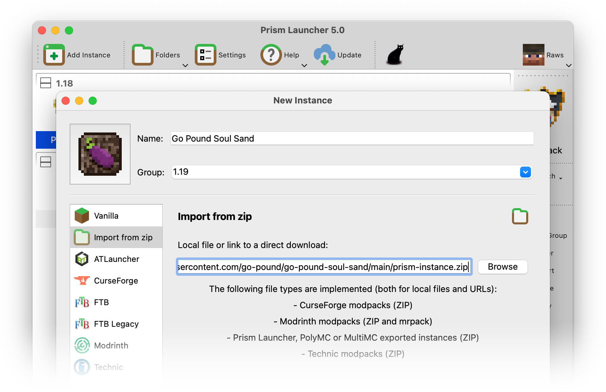
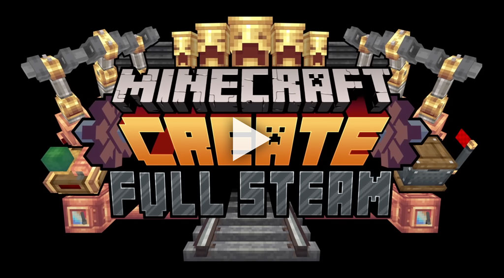
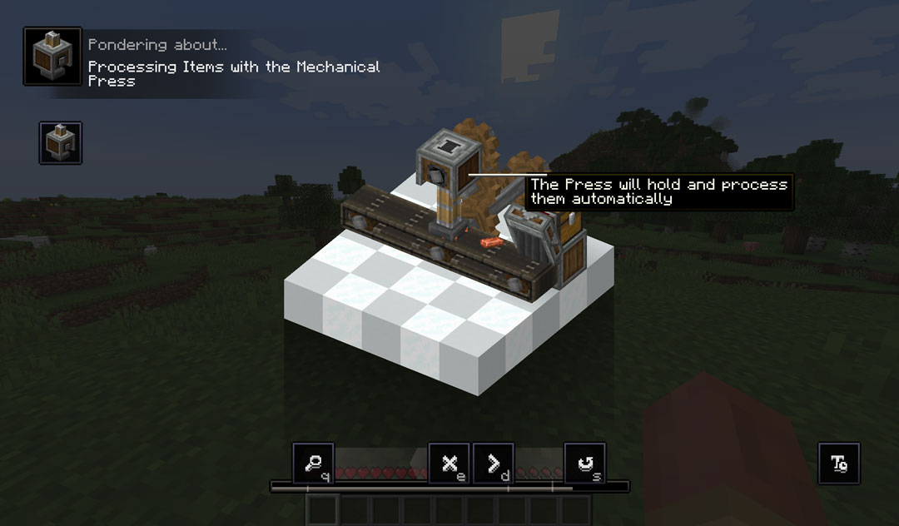

# Go Pound Soul Sand

Go Pound Soul Sand is Go Pound's Minecraft mod pack.

## Contents

1. [How to play](#how-to-play)
1. [Mods](#mods)
   1. [Create](#create)
   1. [New content](#new-content)
   1. [Quality of life](#quality-of-life)
   1. [Shaders](#shaders)
   1. [Performance](#performance)
1. [Contributing](#contributing)
   1. [Setting up a local development environment](#setting-up-a-local-development-environment)
   1. [Versioning](#versioning)
1. [License](#license)

## How to play

Go Pound Soul Sand is distributed as a self-updating [Prism Launcher](https://prismlauncher.org/) instance. (As Prism is a fork of PolyMC, which is itself a fork of MultiMC, those launchers will probably work, too, but [you may want to avoid them](https://prismlauncher.org/wiki/overview/faq/).) To get started:

1. Follow [Prism's guide to installing Adoptium's Temurin 17 Java distribution](https://prismlauncher.org/wiki/getting-started/installing-java/). (If you've only used Mojang's official Minecraft launcher, this is probably a new step for you—Mojang is able to package its own version of Java, but Prism cannot, so you need to install it yourself.)
1. Download, install and launch [Prism Launcher](https://prismlauncher.org/download/) for your platform.
1. Click "Add Instance". The "New Instance" window will open. Give your instance a name, like "Go Pound Soul Sand". You can optionally set a group, which is a way to organize your Minecraft instances in the main Prism Launcher window. For example, you could group your instances by Minecraft game version.
1. In the left sidebar, select "Import from zip".
1. Copy and paste this URL into the text field: https://raw.githubusercontent.com/go-pound/go-pound-soul-sand/main/prism-instance.zip
1. Click OK. Prism will create a new instance with the name you specified. Double-click the icon to play! Every time you launch the game, Go Pound Soul Sand will automatically update itself.



## Mods

Here are the major, game-changing mods included in the pack. For an exhaustive list, including dependencies and version numbers, see the `*.pw.toml` metadata files in the [`mods` folder](mods).

### Create

Go Pound Soul Sand is built around [Create](https://modrinth.com/mod/create-fabric). Create adds a variety of blocks and tools with which you can build mechanical contraptions to automate and decorate your world—think conveyer belts, steam engines, mechanical presses, automated train networks, and much more. To get an idea of what's possible with Create, check out its trailer:

[](https://www.youtube.com/watch?v=rR8W-f9YhYA)

Create features interactive, in-game documentation using a system called "Ponder". To try it out, open up your inventory and filter it to Create's blocks and items by typing `@create` into the search bar. Find a block or item with "Hold [w] to ponder" in its tooltip to view its animated tutorial:



There's also lots of educational Create content on YouTube!

### New content

* [Auditory](https://modrinth.com/mod/auditory) adds unique block placement sounds.
* [BetterEnd](https://modrinth.com/mod/betterend) is a total redesign of the End dimension.
* [BetterNether](https://modrinth.com/mod/betternether) is a total redesign of the Nether.
* [Chalk](https://modrinth.com/mod/chalk) improves your spelunking experience by adding chalk, with which you can mark blocks (such as cave walls) with arrows. You can even make the chalk glow in the dark!
* [Connectible Chains](https://modrinth.com/mod/connectible_chains) adds decorative chains. String them between your fence posts!
* [Diagonal Fences](https://modrinth.com/mod/diagonal-fences) does what it says on the tin.
* [Dynamic Surroundings](https://modrinth.com/mod/dynamicsurroundings_remasteredfabric) enhances background sounds and adds subtle visual effects, like particle effects on waterfalls.
* [Earth2Java](https://modrinth.com/mod/earth2java) adds the mobs from Mojang's [Minecraft Earth](https://minecraft.fandom.com/wiki/Minecraft_Earth).
* [Ecologics](https://www.curseforge.com/minecraft/mc-mods/ecologics) updates vanilla biomes with fun mobs, blocks and structures!
* [Farmer's Delight](https://modrinth.com/mod/farmers-delight-fabric) "gently expands upon" the vanilla farming experience, with several new crops, foods and blocks. Follow its advancements in-game (press <kbd>L</kbd> to view the advancements screen), or read its [getting started guide](https://github.com/vectorwing/FarmersDelight/wiki/Getting-Started) to learn more.
* [Immersive Portals](https://modrinth.com/mod/immersiveportals) allows you to see through Nether and End portals, and walk through them without a loading screen.
* [Naturalist](https://www.curseforge.com/minecraft/mc-mods/naturalist) adds immersive wildlife with realistic behavior! 🐘
* [Oh the Biomes You'll Go](https://modrinth.com/mod/biomesyougo) adds a large variety of realistic and fantastical biomes to the world.
* [Supplementaries](https://www.curseforge.com/minecraft/mc-mods/supplementaries) includes lots of small additions in the spirit of the vanilla game—jars, signposts, faucets, weather vanes, sconces, lights, and other decoration and automation blocks. Check out [its wiki](https://github.com/MehVahdJukaar/Supplementaries/wiki) for full documentation.
* [Tom's Simple Storage Mod](https://modrinth.com/mod/toms-storage) adds methods of connecting chests together with a single, searchable inventory interface.
* [Towns and Towers](https://modrinth.com/mod/towns-and-towers) adds new villages, pillager outposts, and other structures to the world.
* [Traveler's Backpack](https://www.curseforge.com/minecraft/mc-mods/travelers-backpack-fabric) adds customizable backpacks for adventurers!
* [William Wythers' Overhauled Overworld](https://www.curseforge.com/minecraft/mc-mods/william-wythers-overhauled-overworld) adds over 200 new unique biomes, in addition to the ones already added by Oh the Biomes You'll Go.
* [YUNG's Better Desert Temples](https://www.curseforge.com/minecraft/mc-mods/yungs-better-desert-temples-fabric) completely overhauls vanilla desert temples, making them bigger and more complex.
* [YUNG's Better Dungeons](https://www.curseforge.com/minecraft/mc-mods/yungs-better-dungeons-fabric) revamps vanilla dungeons, adding more variety, rooms, and traps.
* [YUNG's Bridges](https://www.curseforge.com/minecraft/mc-mods/yungs-bridges-fabric) adds pretty bridges to the world.
* [YUNG's Extras](https://www.curseforge.com/minecraft/mc-mods/yungs-extras-fabric) sprinkles a few extra structures and details around the world.
* [YUNG's Better Mineshafts](https://www.curseforge.com/minecraft/mc-mods/yungs-better-mineshafts-fabric) is a total redesign of vanilla mineshafts. They're bigger, more detailed, and have more variety and better loot.
* [YUNG's Ocean Monuments](https://www.curseforge.com/minecraft/mc-mods/yungs-better-ocean-monuments-fabric) overhauls vanilla ocean monuments.
* [YUNG's Better Strongholds](https://www.curseforge.com/minecraft/mc-mods/yungs-better-strongholds-fabric) improves vanilla strongholds with greater complexity, variety and difficulty. Reaching the End just got harder!
* [YUNG's Better Witch Huts](https://www.curseforge.com/minecraft/mc-mods/yungs-better-witch-huts-fabric) adds a few different variations on vanilla witch huts, and revamps their loot to be more witch-like.

### Quality of life

* [AdvancementInfo](https://modrinth.com/mod/advancementinfo) embiggens the advancements screen and gives you hints about what's required for each advancement. (This can be useful if, for example, you're working on a "visit every biome" advancement.)
* [Amecs](https://modrinth.com/mod/amecs) (Alt-Meta-Escape-Control-Shift) allows you to use modifier keys in Minecraft's key bindings, so that e.g. <kbd>B</kbd> and <kbd>Shift</kbd> + <kbd>B</kbd> can be assigned to different functions. It also adds a search field to the key bindings menu.
* [AutoRun](https://modrinth.com/mod/autorun) adds a key bind that toggles running, traveling in boats, and riding animals. Great for long distance travel! On a fresh installation of Go Pound Soul Sand, it's unbound by default.
* [Better Animations Collection](https://modrinth.com/mod/better-animations-collection) improves vanilla mobs with more detailed animations and subtle effects.
* [BetterF3](https://modrinth.com/mod/betterf3) replaces the default debug HUD (<kbd>F3</kbd> by default) with a more readable and customizable version.
* [Continuity](https://modrinth.com/mod/continuity) removes the frames between adjacent glass blocks to create the appearance of a single unbroken pane. If you prefer vanilla-style glass, you can disable Continuity's resource pack in the game options.
* [Couplings](https://modrinth.com/mod/couplings) opens connected doors, fence gates and trap doors. Finally!
* [EMI](https://modrinth.com/mod/emi) is an improved in-game recipe viewer with a searchable database of blocks and items.
* [FallingTree](https://modrinth.com/mod/fallingtree) speeds up your ruthless deforestation by adding a "Chopping" axe enchantment that enables you to fell an entire tree by breaking one of its logs. (Damage to your axe and the time it takes to break the log scales with the size of the tree, so you're only gaining the convenience of not needing to climb the tree to chop it down.)
* [Inventory Profiles Next](https://modrinth.com/mod/inventory-profiles-next) adds sorting buttons to inventory screens, helps you move items between inventories, can automatically replace broken tools, and more.
* [Iris](https://modrinth.com/mod/iris) adds support for third-party shader packs, such as [Complementary](https://www.curseforge.com/minecraft/customization/complementary-shaders).
* [LambDynamicLights](https://modrinth.com/mod/lambdynamiclights) makes light-emitting items like torches affect the world when they're held in your hand (or dropped on the ground, or in a fox's mouth).
* [Mouse Tweaks](https://modrinth.com/mod/mouse-tweaks) enhances the vanilla RMB item dragging mechanic to make it more useful, adds two new LMB dragging mechanics, and the ability to quickly move items between inventories using your scroll wheel.
* [Stay True](https://www.curseforge.com/minecraft/texture-packs/stay-true) is a resource pack that adds variations to break up the vanilla game's repetitive textures. It also makes leaves bushy! If you prefer the vanilla look, you can disable the resource pack in the game options.
* [Time & Wind](https://www.curseforge.com/minecraft/mc-mods/time-wind) allows us to modify the length of the game's day and night cycle.
* [Toast Manager](https://www.curseforge.com/minecraft/mc-mods/toast-manager) disables the tutorial and recipe toast notifications that you probably no longer need to guide you through the game. (But you can re-enable them in the mod's settings screen if you wish.)
* [TrashSlot](https://modrinth.com/mod/trashslot) adds a trash slot to your inventory, allowing you to quickly and easily dispose of unwanted items.
* [Universal Graves](https://modrinth.com/mod/universal-graves) sticks your inventory and XP in a gravestone, complete with your head on it, when you die.
* [WTHIT](https://modrinth.com/mod/wthit) (What the Hell is That?) adds an optional hint to your in-game UI that shows the name and other useful details of the block or mob you're looking at.
* [Xaero's World Map](https://www.curseforge.com/minecraft/mc-mods/xaeros-world-map) and [Xaero's Minimap](https://www.curseforge.com/minecraft/mc-mods/xaeros-minimap) provide an in-game map with custom waypoints, player and entity markers, and many more features.
* [Zoomify](https://modrinth.com/mod/zoomify) adds a highly-configurable zoom key (<kbd>C</kbd> by default) for all you zoomers out there.

### Shaders

Go Pound Soul Sand comes with several popular [shader](https://en.wikipedia.org/wiki/Shader) packs, each with a distinct visual style. To try them out, press <kbd>O</kbd> in-game (or navigate to Options > Video Settings > Shader Packs) to bring up the shader selection screen, select a pack, and click "Apply". Press <kbd>K</kbd> to quickly toggle your chosen shaders on and off.

Note that shaders tax your GPU and will impact game performance. They're purely visual effects, so it's up to you whether you enjoy playing with them or not!

* [BSL Shaders](https://www.curseforge.com/minecraft/customization/bsl-shaders)
* [Complementary](https://www.curseforge.com/minecraft/customization/complementary-shaders)
* [Complementary Reimagined](https://www.curseforge.com/minecraft/customization/complementary-reimagined)

Most shader packs are heavily customizable. Use the "Shader Pack Settings…" button on the shader selection screen to tinker around! For example, you can disable real-time reflections to improve performance, opt out of wavy grass, or tone down color saturation to suit your personal taste.

### Performance

* [Debugify](https://modrinth.com/mod/debugify) squashes bugs reported on Mojang's own bug tracker that have yet to be fixed in the vanilla game.
* [Enhanced Block Entities](https://modrinth.com/mod/ebe) improves performance of [block entities](https://minecraft.fandom.com/wiki/Block_entity), such as signs, chests and beds.
* [EntityCulling](https://modrinth.com/mod/entityculling) further improves block entity performance using path tracing to determine which entities are actually visible to you.
* [Fastload](https://modrinth.com/mod/fastload) speeds up initial world loads.
* [FerriteCore](https://modrinth.com/mod/ferrite-core) optimizes the game's memory usage.
* [ImmediatelyFast](https://modrinth.com/mod/immediatelyfast) optimizes the game's [immediate mode](https://en.wikipedia.org/wiki/Immediate_mode_(computer_graphics)) rendering.
* [Krypton](https://modrinth.com/mod/krypton) optimizes the game's multiplayer networking.
* [LazyDFU](https://modrinth.com/mod/lazydfu) makes the game boot faster.
* [Lithium](https://modrinth.com/mod/lithium) heavily optimizes game logic, such as Redstone evaluation.
* [Memory Leak Fix](https://modrinth.com/mod/memoryleakfix) does what it says on the tin.
* [Smooth Boot](https://modrinth.com/mod/smoothboot-fabric) tinkers with JVM knobs to improve CPU scheduling.
* [Sodium](https://modrinth.com/mod/sodium) completely replaces the game's rendering engine with a highly-optimized, modern take.
* [Starlight](https://modrinth.com/mod/starlight) replaces the vanilla lighting engine with a much faster one.

## Contributing

Go Pound Soul Sand is managed using [packwiz](https://github.com/packwiz/packwiz), a command line tool for creating Minecraft mod packs.

To add mods to the pack, use [packwiz's install commands](https://packwiz.infra.link/tutorials/creating/adding-mods/). For example, to add [Fabric API 0.64.0](https://modrinth.com/mod/fabric-api/version/0.64.0%2B1.19.2) to the pack:

```sh
packwiz modrinth install https://modrinth.com/mod/fabric-api/version/9nx74dYD
```

Updating a mod to the latest-available release is easy:

```console
$ packwiz update farmers-delight-fabric
Loading modpack...
Update available: farmers-delight-fabric-1.19.X-1.3.6.jar -> farmers-delight-fabric-1.19.X-1.3.9.jar
"Farmer's Delight [Fabric]" updated!
```

If you commit changes, please add release notes to [the changelog](/CHANGELOG.md).

### Setting up a local development environment

You can use [Docker Compose](https://docs.docker.com/compose/) to set up a local development environment. The included [docker-compose.yml](docker-compose.yml) will:

* Start an HTTP server on port 8082 that will serve up [pack.toml](pack.toml) and other packwiz files.
* Start a Minecraft game server on port 25565 (the game's default) using those local pack files.

To start both servers, run `docker-compose up` in this repository's root directory. Minecraft server data will be written into `tmp/server` and ignored by Git. The Docker Compose file includes defaults that will be written to `server.properties`. Once the file is generated, you can customize it.

To create a Prism Launcher instance that connects to your local HTTP server, import [prism-instance.zip](prism-instance.zip) to create a new instance. Right-click on the instance and select Edit > Settings > Custom commands. Change the pre-launch command to point at your local server:

```sh
"$INST_JAVA" -jar packwiz-installer-bootstrap.jar http://localhost:8082/pack.toml
```

### Versioning

Go Pound Soul Sand is [semantically versioned](https://semver.org). The [build metadata field](https://semver.org/#spec-item-10) is used to denote the compatible version of Minecraft. For example:

* Go Pound Soul Sand 1.0.3+1.18.1 is compatible with Minecraft 1.18.1
* Go Pound Soul Sand 1.2.0-pre3+1.19.2 is compatible with Minecraft 1.19.2

## License

The scripts and tools created for this repository are licensed under the MIT license. (See `LICENSE` for the full license text.) Minecraft, and the Minecraft mods referenced by, but not distributed with, the contents of this repository may be subject to different license terms.
